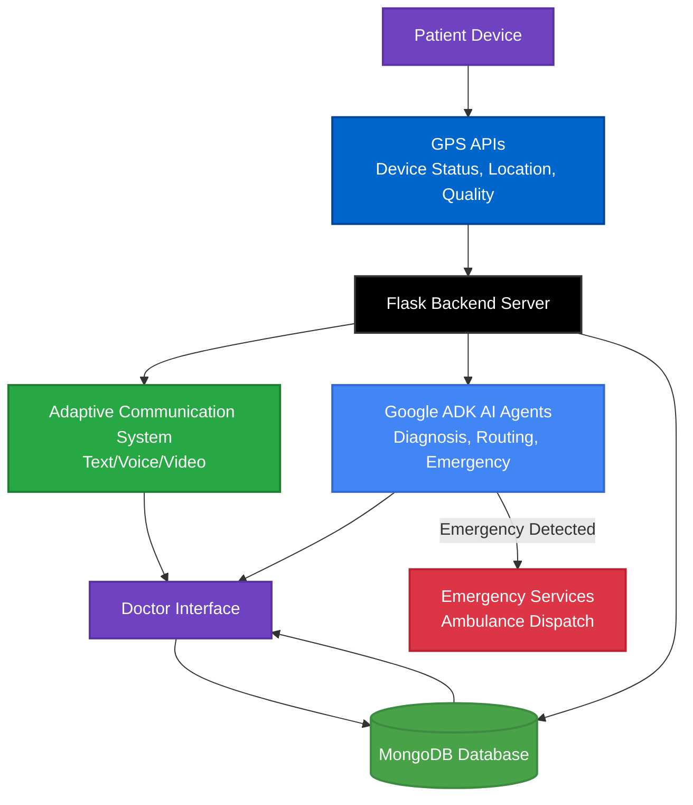
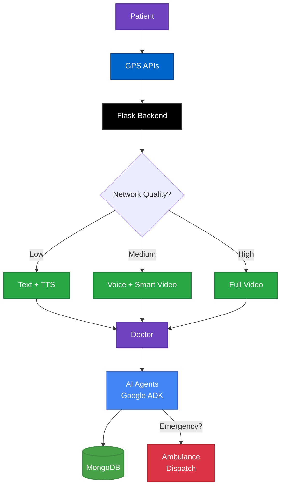
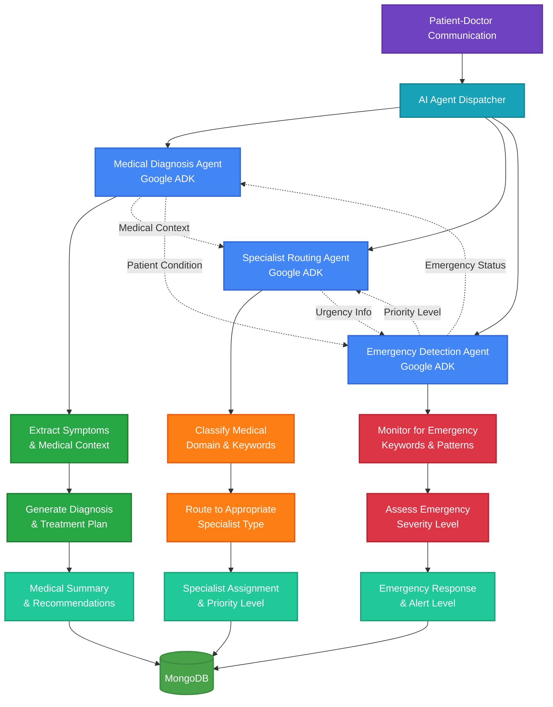

# AMDHackathon
 
## Running on Android (using ADB & Android Studio)

1. Install Android Studio:

```
  brew install --cask android-studio
```

2. Open Android Studio and install SDK:
  - Launch Android Studio
  - Click "More Actions" → "SDK Manager"
  - Install:
    - Android SDK Platform (latest)
    - Android SDK Build-Tools
    - Android SDK Command-line Tools

3. Set environment variables:

```
Add to ~/.zshrc (or ~/.bash_profile):

export ANDROID_HOME=$HOME/Library/Android/sdk
export PATH=$PATH:$ANDROID_HOME/emulator
export PATH=$PATH:$ANDROID_HOME/platform-tools
export PATH=$PATH:$ANDROID_HOME/tools
export PATH=$PATH:$ANDROID_HOME/tools/bin
```

4. Reload terminal:

```
  source ~/.zshrc
```

5. Verify:

```
  adb --version
```

6. Run

```
  npx expo run:android
```

## Running iOS

```
cd react_native
npm install
npx expo prebuild --clean
npx expo run:ios
```

## Building APK using Expo.dev

```
cd react_native

# One time login to expo.dev
eas login 

# One time config generation
eas build:configure 

eas build --platform android --profile preview
```

## System Architecture 



## Flow Diagram



## Multi AI Agent System Architecture



## iOS APP Screenshots

| | | |
|:---:|:---:|:---:|
|  |  |  |
|  |  |  |
|  |  | |

 

